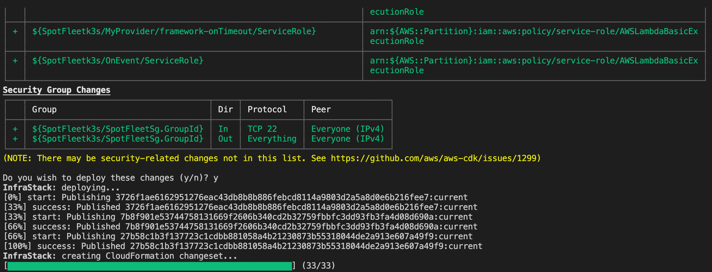
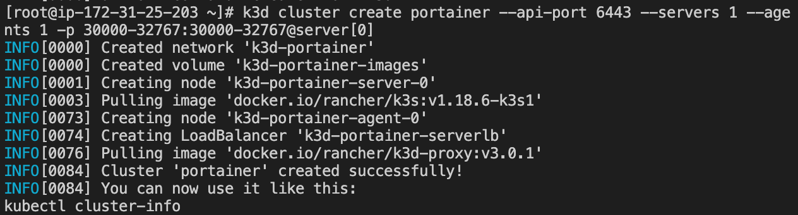
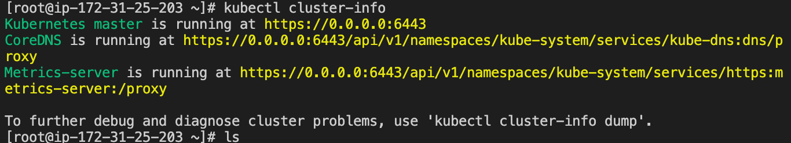
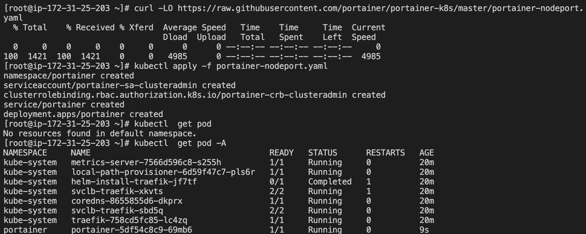
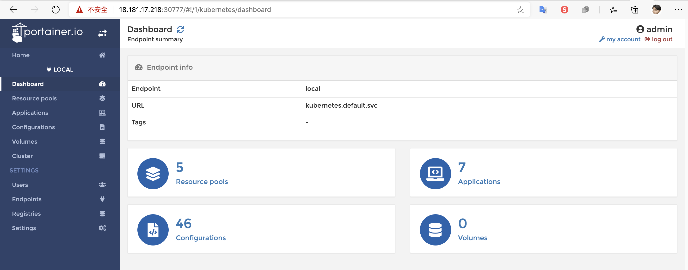

## Install k3s Lab in `AWS Spot EC2` via `AWS CDK` infra

### Infra 
```bash
# create infra
cdk deploy --require-approval never 

# connect k3s node
aws ssm start-session ${INSTANCE_ID}
```

### K3s Manual create cluster via [k3d](https://k3d.io/)
```bash
# add /usr/local/bin/ to $PATH
export PATH=$PATH:/usr/local/bin/

# Download kubectl 
curl -LO "https://storage.googleapis.com/kubernetes-release/release/$(curl -s https://storage.googleapis.com/kubernetes-release/release/stable.txt)/bin/linux/amd64/kubectl"

chmod +x kubectl

mv kuebctl /usr/local/bin/


# install k3d 
curl -s https://raw.githubusercontent.com/rancher/k3d/main/install.sh | bash

# k3d create cluster
k3d cluster create portainer \
--api-port 6443 \
--servers 1 \
--agents 1 \
-p 30000-32767:30000-32767@server[0]
```


```bash
# Create portainer
curl -LO https://raw.githubusercontent.com/portainer/portainer-k8s/master/portainer-nodeport.yaml | kubectl apply -f -
```


## Usege: 
- [cdk-spot-one](https://github.com/pahud/cdk-spot-one)
- [k3d](https://k3d.io/)
- [k3s](https://k3s.io/)
- [portainer-k8s](https://github.com/portainer/portainer-k8s)
